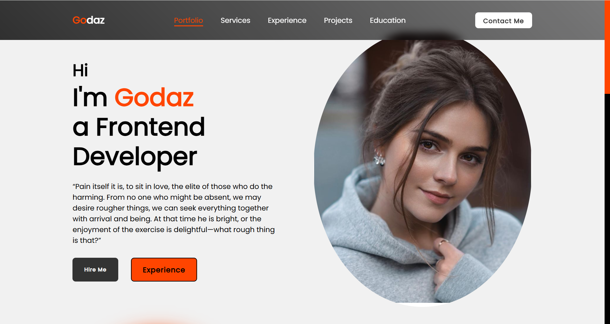
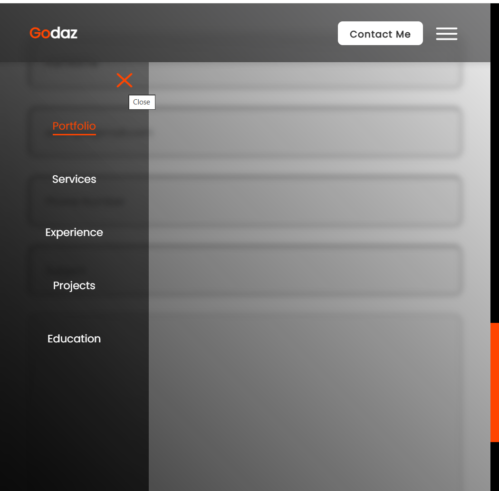
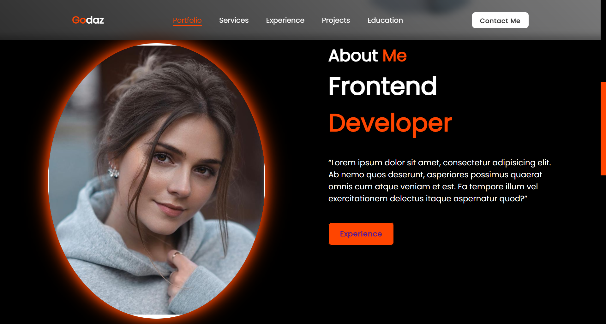
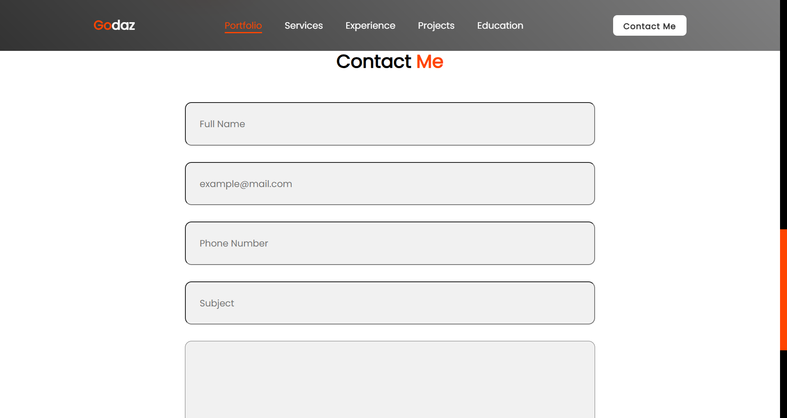
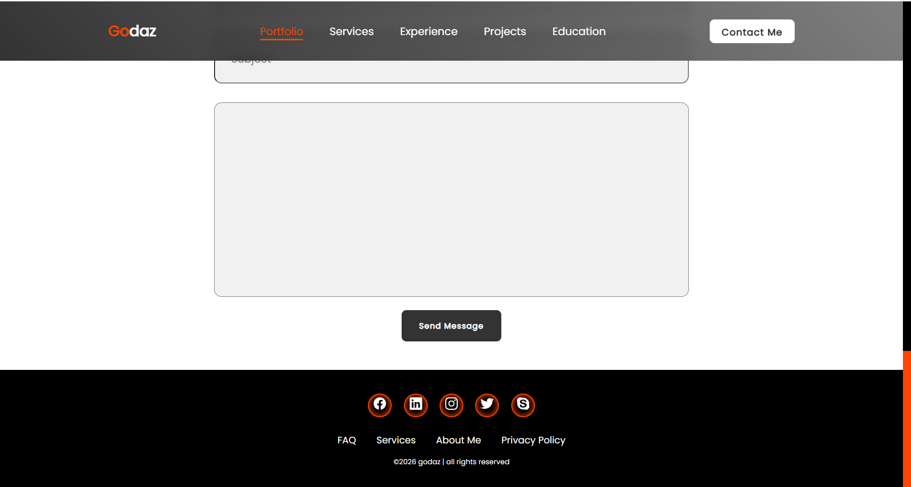

# 📁 Portfolio Website — Frontend Project

## 📌 Overview
This is a **responsive personal portfolio website** developed using **HTML, CSS, and JavaScript**.
It showcases a developer’s profile, services, experience, projects, and contact information in a modern UI layout.
The project emphasizes **responsive design, mobile navigation, and clean frontend structure**.
---

## 🚀 Features
* 📱 Fully Responsive Design
* 🧭 Desktop & Mobile Navigation
* 🍔 Toggle Menu (Open / Close)
* 🎨 Modern Gradient Styling
* 🧑 About Me Section
* 📞 Contact Form UI
* 🔗 Social Media Footer
* ✨ Hover Animations & Transitions
---

## 🛠️ Technologies Used
* **HTML5** — Structure
* **CSS3** — Styling & Responsiveness
* **JavaScript (Vanilla JS)** — Toggle functionality
* **Ionicons** — Icons
---

## 📷 Website Preview (Screenshots)

### 🖥️ Desktop View



### 📱 Mobile View



##About

##Contact

##footer


---

## 📂 Project Structure
```
portfolio-website/
│
├── responsive_portfolio.html
├── responsive_portfolio.css
│  
├── responsive_portfolio.js
│   
├── images/
│   └── person.png
├── screenshots/
│   ├── desktop.png
│   ├── mobile.png
│   └── menu.png
└── README.md
```
---

## ⚙️ How to Run
```bash
git clone https://github.com/takundagorogodo/portfolio-website.git
cd responsive-portfolio-website
Open **responsive_portifolio.html** in your browser.
---

## 🎯 Learning Objectives
* Responsive Layout Design
* Flexbox & Media Queries
* Mobile Navigation Systems
* DOM Manipulation
* CSS Animations & Transitions
---

## 🔮 Future Improvements
* Add project showcase cards
* Backend contact form integration
* Dark / Light theme toggle
* Deploy via GitHub Pages
---

## 👤 Author
**Takunda Gorogodo**
GitHub: [https://github.com/takundagorogodo](https://github.com/takundagorogodo)
Frontend Developer Portfolio Project

---

## 📜 License

Open-source — free to use for learning and inspiration.
